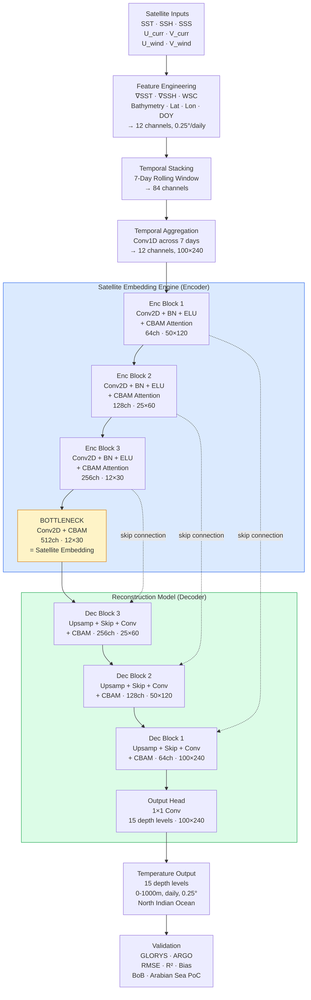

# OceanEmbed — Architecture Design
### SIH 2026 | INCOIS Problem Statement #SIH26066

---


## 2. Naming the System Components

The problem statement specifically asks for:
1. A **preprocessing pipeline**
2. A **satellite embedding engine**
3. A **reconstruction model**
4. A **validation framework**

Our system maps onto these cleanly:

```
┌─────────────────────────────────────────────────────────┐
│                    OceanEmbed System                    │
│                                                         │
│  [1] PREP PIPELINE → [2] EMBEDDING ENGINE → [3] RECON   │
│                                                ↕        │
│                              [4] VALIDATION FRAMEWORK   │
└─────────────────────────────────────────────────────────┘
```

---

## 3. Component 1 — Preprocessing & Feature Engineering Pipeline

### 3.1 Domain & Resolution

- **Spatial:** 5°N–30°N, 45°E–105°E → **100 × 240 grid** at 0.25°
- **Temporal:** Daily
- **All inputs regridded** to 0.25° × 0.25° via bilinear interpolation

### 3.2 Input Feature Set — 12 Channels

This is the most carefully designed part. Every feature is chosen for a specific reason.

| # | Feature | Derived From | Why Include |
|---|---|---|---|
| 1 | **SST** | OSTIA (0.05° → 0.25°) | Dominant predictor at all depths |
| 2 | **∇SST** (log-magnitude) | Derived from SST | Captures ocean fronts and mesoscale eddies; reduces upper-ocean error |
| 3 | **SSH** | DUACS (already 0.25°) | Critical bridge to thermocline; integrates steric height |
| 4 | **∇SSH** (log-magnitude) | Derived from SSH | Frontal sharpness; geostrophic current gradients |
| 5 | **SSS** | SMAP/SMOS (0.125° → 0.25°) | Indian Ocean halocline, barrier layer effects in BoB |
| 6 | **WSC** | Derived from U_wind, V_wind | Ekman pumping/suction signal — correct wind representation |
| 7 | **U_curr** | OSCAR (0.25°) | Required by PS; encodes geostrophic balance and transport |
| 8 | **V_curr** | OSCAR (0.25°) | Required by PS; meridional heat transport in NIO |
| 9 | **Bathymetry** | ETOPO (static) | Eliminates summer anomaly errors; critical for marginal seas |
| 10 | **Latitude grid** | Static (0.25° grid) | Region-specific surface-subsurface coupling (BoB vs AS) |
| 11 | **Longitude grid** | Static (0.25° grid) | East-west asymmetry in NIO; upwelling zones |
| 12 | **Day-of-Year** (normalized) | Calendar | Monsoon cycle encoding; seasonal phase |

> [!IMPORTANT]
> **We do NOT include raw U_wind, V_wind directly.**  raw wind components alone *increase* surface temperature RMSE. We use Wind Stress Curl (WSC) instead — which captures the Ekman pumping signal that actually links winds to subsurface temperature.

> [!IMPORTANT]
> **We do NOT include SLA separately.** Adding SLA alone to SST raises mixed layer RMSE from 0.43°C → 0.62°C. We use SSH (absolute dynamic topography) which is the physically correct quantity.

### 3.3 Derived Feature Computations

```
∇SST  = log(√((∂SST/∂x)² + (∂SST/∂y)²) + ε)    # ε=1e-6 for numerical stability
∇SSH  = log(√((∂SSH/∂x)² + (∂SSH/∂y)²) + ε)
WSC   = ∂(τ_y)/∂x - ∂(τ_x)/∂y                   # τ = wind stress = ρ_air * C_D * |U| * U
```

### 3.4 Normalization

- All 12 input channels: **Z-score normalization** (subtract per-channel mean, divide by std, computed over training period)
- Output (temperature): **Z-score normalization** per depth level (to handle the fact that deeper layers have smaller variance)
- Static channels (Bathymetry, Lat, Lon, DOY): normalized once globally
- Land mask: binary (1=ocean, 0=land) — passed to loss function

### 3.5 Temporal Window — 7-Day Stacked Input


**Our choice:** 7-day window — pragmatic balance between information gain and computational feasibility

- Stack T, T-1, T-2, T-3, T-4, T-5, T-6 (7 daily snapshots)
- Stacked input shape: **(7 × 12)** = **84 channels**, spatial (100 × 240)
- A lightweight **temporal aggregation layer** (1D temporal convolution across the 7 days) condenses this into a **12-channel fused surface state** before the main U-Net

**Physical rationale:** Surface signals integrate over time (Ekman transport timescale ~3–7 days; mixed layer response to wind forcing ~1–5 days). Today's SSH anomaly reflects eddy activity that began several days ago. The 7-day window captures these dynamics without excessive memory cost.

---

## 4. Component 2 — Satellite Embedding Engine

This is the **encoder** half of our U-Net. The problem statement explicitly asks for an embedding engine — the bottleneck of our U-Net IS this engine.

```
Surface Feature Maps (12 channels, 100×240)
         ↓
  Temporal Aggregation
  (7-day → fused state)
         ↓
  ┌────────────────────────────────────┐
  │   U-Net Encoder (CBAM blocks)      │
  │                                    │
  │  Block 1: Conv→BN→ELU→CBAM→Pool    │  64 ch, 50×120
  │  Block 2: Conv→BN→ELU→CBAM→Pool    │  128 ch, 25×60
  │  Block 3: Conv→BN→ELU→CBAM→Pool    │  256 ch, 12×30
  │                                    │
  │  ┌──── BOTTLENECK ─────────────┐   │
  │  │  Conv 512→BN→ELU→CBAM       │   │  ← SATELLITE EMBEDDING
  │  │  Shape: (B, 512, 12, 30)    │   │    Compact latent representation
  │  └─────────────────────────────┘   │    of surface ocean dynamics
  └────────────────────────────────────┘
```

### 4.1 CBAM Module (inside each encoder block)

**Why CBAM:** It reduces RMSE by ~0.01°C AND halves training variance (σ_RMSE drops from 0.0075 → 0.0036). For a hackathon where we train once, stability matters enormously.

CBAM has two sequential sub-modules:

**Channel Attention (CAM):** "Which of my 12 input variables is most important right now?"
```
M_c(F) = σ( MLP(AvgPool(F)) + MLP(MaxPool(F)) )
```
- Adaptively upweights SST+SSH when they correlate well with subsurface structure
- Downweights noisy SSS in regions with poor satellite coverage

**Spatial Attention (SAM):** "Where in the NIO domain is the most informative region?"
```
M_s(F) = σ( f^{7×7}([AvgPool(F); MaxPool(F)]) )
```
- Focuses on the Arabian Sea upwelling region in summer
- Focuses on BoB river outflow regions during monsoon

### 4.2 What the Embedding Represents

The **512-channel bottleneck tensor** at spatial resolution (12 × 30) captures the ocean's surface state at a ~3° effective resolution (by which point large-scale patterns dominate). Each spatial location in this bottleneck holds a **learned 512-dimensional code** that summarizes:
- Which dynamic regime the ocean is in (upwelling vs downwelling; monsoon vs inter-monsoon)
- The integrated mesoscale eddy signature
- The large-scale thermocline depth signal


---

## 5. Component 3 — Subsurface Reconstruction Model

### 5.1 Decoder Architecture (U-Net Decoder with CBAM)

```
  BOTTLENECK EMBEDDING (512 ch, 12×30)
         ↓
  ┌────────────────────────────────────────┐
  │   U-Net Decoder (CBAM + skip conn)     │
  │                                        │
  │  UpBlock 3: Upsamp + Skip + Conv 256   │  256 ch, 25×60
  │             + CBAM                     │
  │  UpBlock 2: Upsamp + Skip + Conv 128   │  128 ch, 50×120
  │             + CBAM                     │
  │  UpBlock 1: Upsamp + Skip + Conv 64    │  64 ch, 100×240
  │             + CBAM                     │
  │                                        │
  │  Output Head: 1×1 Conv                 │  15 ch, 100×240
  └────────────────────────────────────────┘
         ↓
  Temperature at 15 depth levels
  Shape: (B, 15, 100, 240)
```

### 5.2 Key Design Choices in the Decoder

**Skip connections:** Preserve fine-scale spatial details (fronts, eddies) from the encoder — exactly what U-Net was designed for. The encoder captures global patterns; the skip connections re-inject local spatial structure at each resolution scale.

**Unified vertical output (all 15 depths at once):* The 1×1 conv final layer projects the 64-channel feature map to 15 depth channels simultaneously. This means the model learns **thermodynamic coupling between depth levels** via the channel dimension — deeper and shallower layers are not independent.

**ELU activation throughout:**(Indian Ocean context). ELU is preferred over ReLU in ocean settings because it allows small negative outputs (physically, ocean temperature anomalies can be negative) and reduces the vanishing gradient problem.

**Batch Normalization:** After every conv layer, before activation. Keeps gradients stable across the very different variance levels of the 12 input channels.

### 5.3 Full Architecture Summary

```
INPUT:       (B, 84, 100, 240)   [7 days × 12 channels]
             ↓
Temporal:    Conv1D across time   → (B, 12, 100, 240)
             ↓
Enc1+CBAM:  Conv2D(12→64)+CBAM  → (B, 64, 100, 240)  → MaxPool → (B, 64, 50, 120)
Enc2+CBAM:  Conv2D(64→128)+CBAM → (B, 128, 50, 120)  → MaxPool → (B, 128, 25, 60)
Enc3+CBAM:  Conv2D(128→256)+CBAM→ (B, 256, 25, 60)   → MaxPool → (B, 256, 12, 30)
Bottleneck: Conv2D(256→512)+CBAM→ (B, 512, 12, 30)   ← SATELLITE EMBEDDING
             ↓
Dec3+CBAM:  Upsamp+skip+Conv(768→256)+CBAM → (B, 256, 25, 60)
Dec2+CBAM:  Upsamp+skip+Conv(384→128)+CBAM → (B, 128, 50, 120)
Dec1+CBAM:  Upsamp+skip+Conv(192→64)+CBAM  → (B, 64, 100, 240)
Output:     Conv2D(64→15)                  → (B, 15, 100, 240)

Total parameters: ~12–15 million  
```


---

## 6. Loss Function — Depth-Stratified Masked RMSE

### 6.1 Why Not Just Plain MSE?

- Plain MSE doesn't account for the **land mask** (spurious gradients from land pixels)
- Plain MSE treats all 15 depth levels equally, but the thermocline is 5× harder than the deep ocean — we should weight it appropriately
- Borrowed from masked volumetric RMSE design

### 6.2 The Loss Function

```
L = Σ_{z=1}^{15}  w_z * RMSE_z

where:

RMSE_z = √( (1/N_valid) * Σ_{i,j} M_{i,j} * (T_z(i,j) - T̂_z(i,j))² )

M_{i,j} = land mask (1=ocean, 0=land)
N_valid = number of valid ocean pixels
```

### 6.3 Depth Zone Weights

| Depth Zone | Depths (m) | Weight w_z | Reason |
|---|---|---|---|
| **Mixed Layer** | 0, 5, 10, 20, 30 | 1.0 | Baseline; relatively well-constrained by SST |
| **Thermocline** | 50, 75, 100, 125, 150, 200 | **2.0** | Hardest zone; most important for applications (fisheries, MHW) |
| **Deep Ocean** | 300, 500, 700, 1000 | 0.5 | Easiest zone; model gets these almost for free |

**Physical reasoning:** The thermocline is where errors have the most real-world impact (marine heatwave monitoring, fisheries, data assimilation initialization) AND where the surface-subsurface coupling is weakest. By doubling its loss weight, we force the model to focus learning effort on the hardest part.

---

## 7. Training Strategy — Two-Stage Transfer Learning
Use transfer learning for this problem type, with improvement (RMSE drops from 0.3779 → 0.3512).

### 7.1 Why Transfer Learning for Our Context?

- **GLORYS daily data** is available from 1993 onwards, but the NIO subset is still limited in terms of mesoscale variability captured
- **Gridded Argo** from INCOIS LAS provides independent observational constraints
- Pre-training on a stable climatological signal helps the model learn the **mean vertical structure** before learning the harder **anomaly patterns**

### 7.2 Stage 1 — Pre-training on Monthly Climatology

| Parameter | Value |
|---|---|
| **Target labels** | GLORYS monthly climatology (1993–2020 monthly means) at 15 depth levels |
| **Input features** | Same 12-channel set, but using monthly averages |
| **Temporal window** | 1 month (no rolling window; just monthly mean) |
| **Learning rate** | 1e-3 |
| **Epochs** | 50 |
| **Batch size** | 16 |
| **Purpose** | Model learns mean vertical stratification, seasonal thermocline cycle, basic surface-subsurface physics |
| **Expected outcome** | Model accurately reconstructs climatological temperature profiles; poor on anomalies |

### 7.3 Stage 2 — Fine-tuning on Daily GLORYS

| Parameter | Value |
|---|---|
| **Target labels** | GLORYS daily (1993–2020 for training, 2021–2023 for validation) |
| **Input features** | Same 12-channel set with **7-day rolling window** |
| **Learning rate** | 1e-4 (lower — fine-tune, don't overwrite pre-trained weights) |
| **Epochs** | 100–150 |
| **Batch size** | 8 (larger spatial domain than prior papers; memory constraint) |
| **Weight freezing** | **None** — full fine-tuning |
| **Purpose** | Model learns day-to-day variability, mesoscale eddies, monsoon-driven anomalies |
| **Expected outcome** | Model captures both seasonal patterns AND synoptic events |

### 7.4 Training Split

| Period | Usage |
|---|---|
| 1993–2019 | Stage 2 training |
| 2020–2022 | Validation (loss monitoring, early stopping) |
| 2023 | **Held-out test** |
| ARGO (INCOIS LAS) | Independent validation — **never seen during training** |


## 8. Component 4 — Validation Framework

### 8.1 Primary Metrics (per depth level)

| Metric | Formula | Target |
|---|---|---|
| **RMSE** | √(Σ(T̂-T)²/N) | See targets below |
| **Bias** | mean(T̂-T) | < ±0.1°C at all depths |
| **R²** | 1 - SS_res/SS_tot | > 0.95 at all depths |
| **Pearson r** | corr(T̂, T) | > 0.97 at all depths |

### 8.2 Validation Datasets

1. **Primary:** GLORYS test set (2023) — direct comparison of reconstruction vs. reanalysis
2. **Gold standard:** Gridded ARGO from INCOIS LAS — independent in-situ profiles (never seen in training)
3. **Sub-region validation:** Separate analysis for Bay of Bengal and Arabian Sea

### 8.3 Validation Analyses to Report

1. **Vertical RMSE profile** — RMSE vs depth (all 15 levels) → shows thermocline challenge
2. **Seasonal error analysis** — per season (JJAS monsoon, DJF winter monsoon, MAM, SON) → shows monsoon impact
3. **Spatial error maps** — at 30m, 100m, 300m → shows regional accuracy
4. **SHAP feature importance** — per depth zone and per season → explainability
5. **Time-depth plots** — 2023 temperature vs depth over time at key ARGO locations in BoB and AS

### 8.4 SHAP Explainability (for judges)

We run SHAP analysis on 3 representative days per season (12 total) and report:
- Which features drive mixed layer reconstruction in the **Bay of Bengal during summer monsoon** (expect WSC + SST to dominate)
- Which features drive thermocline reconstruction in the **Arabian Sea** (expect SSH + ∇SSH to dominate — upwelling dome)
- How feature importance shifts with depth

This is our **Indian Ocean physics insight** — a novel contribution no prior paper has done specifically for the NIO.

---

## 9. Realistic Accuracy Targets


### 9.2 Our Claimed Targets

| Zone | Depths | RMSE Target | R² Target | Basis |
|---|---|---|---|---|
| Mixed Layer | 0–30 m | **< 0.5°C** | > 0.97 | mix layer RMSE 0.43–0.48°C |
| Thermocline | 50–200 m | **< 1.0°C** | > 0.95 | thermo RMSE 0.89–1.2°C |
| Deep Ocean | 300–1000 m | **< 0.2°C** | > 0.99 | near-zero deep errors |
| **Overall** | **All 15 depths** | **< 0.7°C** | **> 0.96** | Conservative interpolation |
| Bay of Bengal PoC | All depths | < 0.6°C | > 0.97 | BoB monthly baseline, scaled |
| Arabian Sea PoC | All depths | < 0.7°C | > 0.96 | Conservative |

> [!NOTE]
> These targets are **deliberately conservative** — we can confidently claim them because similar or better numbers appear in the literature for comparable settings. If we outperform them, even better.


---

## 10. Architecture Flowchart



---

## 11. Innovation Summary (What's New vs. Prior Work)

| Innovation | What We Add |
|---|---|
| **Physics-informed features** (WSC, ∇SST, ∇SSH) | Applied first time to NIO domain |
| **Depth-stratified loss weighting** | Thermocline weighted 2× — forces model to focus on hardest zone |
| **CBAM attention** in U-Net | Applied to NIO with Indian Ocean-specific surface variables |
| **7-day temporal window** | Scaled down for feasibility; captures Ekman transport timescale |
| **Two-stage transfer learning** | First application to Indian Ocean subsurface reconstruction |
| **Unified vertical output** (all 15 depths) | Model learns thermodynamic coupling between depth layers |
| **NIO-specific SHAP analysis** | First explainability study for BoB and Arabian Sea separately |
| **Day-of-Year encoding** | Captures Indian Ocean monsoon cycle (bi-annual reversal) |
| **INCOIS ARGO validation** | Independent in-situ validation specific to NIO |


---

## 13. Deliverables Mapping

| Problem Statement Requirement | Our Implementation |
|---|---|
| Preprocessing pipeline | Python pipeline: download → regrid to 0.25° → derive WSC, gradients → stack 7-day window → normalize |
| Satellite embedding engine | U-Net encoder bottleneck (512-ch at 12×30) — visualizable, explainable |
| Reconstruction model | U-Net decoder with CBAM + depth-stratified output head |
| Daily 0.25° output | Direct model output shape (B, 15, 100, 240) |
| Validation framework | RMSE/R²/Bias profiles, ARGO comparison, SHAP, seasonal/spatial analysis |
| PoC — Bay of Bengal / Arabian Sea | Sub-domain analysis and case study maps |

---

## 14. Stack & Implementation Plan

| Component | Tool/Library |
|---|---|
| Deep Learning | **PyTorch** (most flexible, best debugging) |
| Data handling | xarray, netCDF4, numpy |
| Regridding | pyinterp, scipy.interpolate |
| SHAP analysis | shap library (KernelSHAP or GradientSHAP) |
| Visualization | matplotlib, cartopy (for geospatial maps) |
| ARGO validation | argovis API or INCOIS LAS download |
| Model training | PyTorch Lightning (clean, built-in logging) |
| Experiment tracking | Weights & Biases (free, visual) |

---

